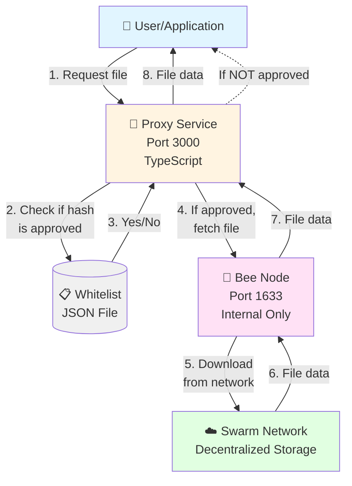
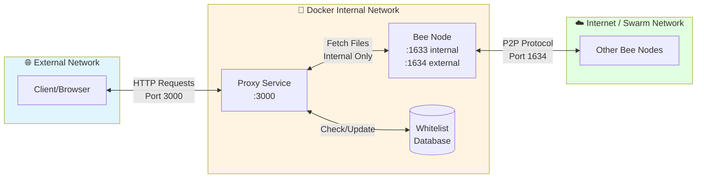
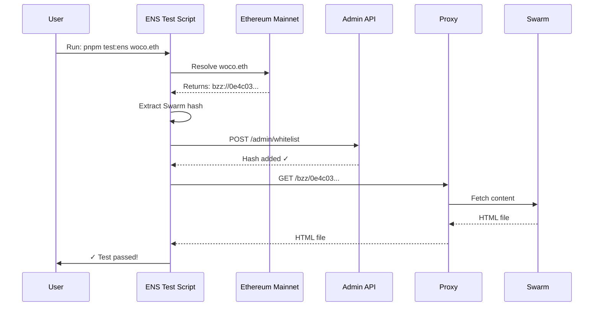

# Simple Architecture Guide

This document explains how the Bee Gateway system works in simple terms.

## What Problem Are We Solving?

We want to access files stored on the Ethereum Swarm network, but we also want to control **which** files can be accessed. Think of it like having a private door to a public library - we can read any book in the library, but only through our special door that checks if we're allowed to access that specific book.

## The Components (Building Blocks)

Our system has three main pieces:

### 1. **Bee Node**
*The Library Card*

- This is software that connects to the Swarm network
- It knows how to find and download files from Swarm
- Think of it as your "library card" that lets you access the Swarm network
- It runs in "ultra-light" mode, which means:
  - It only downloads files (read-only)
  - It doesn't store files for others
  - It doesn't need cryptocurrency to operate

### 2. **Proxy Service**
*The Gatekeeper*

- This is a small web server we built in TypeScript
- It sits in front of the Bee node and checks every request
- It maintains a **whitelist** - a list of approved file hashes
- Think of it as a security guard who checks your ID before letting you in
- Only requests for approved files get passed through to the Bee node

### 3. **Whitelist Database**
*The Guest List*

- A simple JSON file that stores approved file hashes
- Each Swarm file has a unique 64-character identifier (called a "hash")
- Only hashes in this list can be accessed
- You can add or remove hashes while the system is running
- The list survives restarts (it's saved to disk)

## How They Work Together



## Request Flow Step-by-Step

Let's walk through what happens when someone tries to access a file:

### Scenario: Accessing a Swarm File

**Request URL:** `http://localhost:3000/bzz/0e4c03237321d00e46d2607c02033ee991c441c5af891d1a44ced4506fed4d5c`

1. **User sends request** to the Proxy Service (port 3000)
   - The long hex string is the file's unique identifier (hash)

2. **Proxy checks the whitelist**
   - Opens the JSON file
   - Looks for this specific hash

3. **Decision point:**

   **✅ If hash IS in whitelist:**
   - Proxy forwards request to Bee Node (port 1633)
   - Bee Node downloads file from Swarm Network
   - File data flows back: Swarm → Bee → Proxy → User
   - User receives the file ✓

   **❌ If hash is NOT in whitelist:**
   - Proxy immediately rejects the request
   - Returns error: "Access denied, hash not whitelisted"
   - Bee Node is never contacted
   - User receives error message

4. **Result delivered** to user

## Managing the Whitelist

You can control which files are accessible using the Admin API:

### Add a File (Hash) to Whitelist

```bash
curl -X POST http://localhost:3000/admin/whitelist \
  -H "Content-Type: application/json" \
  -d '{"hash":"your-64-character-hash-here"}'
```

### View All Approved Files

```bash
curl http://localhost:3000/admin/whitelist
```

### Remove a File from Whitelist

```bash
curl -X DELETE http://localhost:3000/admin/whitelist/your-hash-here
```

## Security Design

### What's Protected

- **Bee Node is hidden**: It can only be accessed by the Proxy Service
  - The outside world cannot directly contact the Bee Node
  - Port 1633 (Bee's API) is only available inside Docker's internal network

- **Only approved files**: The Proxy enforces the whitelist
  - Even if someone knows a Swarm file hash, they can't access it unless it's approved
  - You control exactly what content is accessible

### What's Exposed

- **Proxy Service**: Port 3000 is accessible from outside
  - This is the only entry point
  - All requests must go through whitelist checking

- **P2P Port**: Port 1634 remains open
  - This is needed for the Bee Node to connect to the Swarm network
  - It only handles peer-to-peer networking (not file access)

## Network Diagram



## ENS Integration (Bonus Feature)

The system includes a test script that demonstrates ENS (Ethereum Name Service) integration:

### What is ENS?

ENS is like DNS for Ethereum - it lets you use human-readable names instead of long hashes.

Example: `woco.eth` → `0e4c03237321d00e46d2607c02033ee991c441c5af891d1a44ced4506fed4d5c`

### How It Works



### Running the ENS Test

```bash
cd proxy
pnpm test:ens              # Tests woco.eth by default
pnpm test:ens mydomain.eth # Test any ENS name
```

This script will:
1. Look up the ENS name on Ethereum mainnet
2. Get the Swarm content hash
3. Add it to the whitelist
4. Try to download the content
5. Show you the result

## Common Questions

### Q: Why do we need the Proxy? Can't we just use Bee directly?

**A:** Yes, technically you could, but then you'd have no control over what content is accessed. The Proxy gives you:
- **Access control**: Only approved files can be downloaded
- **Security**: The Bee node isn't directly exposed to the internet
- **Monitoring**: You can track which files are being accessed
- **Flexibility**: Add/remove approved files without restarting anything

### Q: What is a "hash"?

**A:** A hash is a unique fingerprint for a file. It's a 64-character string of numbers and letters (hexadecimal). Every file in Swarm has one, and it's how you reference that file.

Example: `0e4c03237321d00e46d2607c02033ee991c441c5af891d1a44ced4506fed4d5c`

### Q: Does the Proxy modify the files?

**A:** No! The Proxy just checks if access is allowed, then passes the file through unchanged. It's like a security checkpoint - it checks your ticket but doesn't touch your luggage.

### Q: What happens if I restart the containers?

**A:** The whitelist persists! It's stored in a Docker volume, so approved hashes survive restarts. You won't lose your whitelist.

### Q: Can I access files with subpaths?

**A:** Yes! If a Swarm hash points to a directory/website, you can access files within it:

```
http://localhost:3000/bzz/<hash>/index.html
http://localhost:3000/bzz/<hash>/images/logo.png
```

## Technical Details (For the Curious)

### Technologies Used

- **Bee Node**: Go-based Swarm client (version 2.6.0)
- **Proxy Service**: Node.js with TypeScript, Express 5
- **Containerization**: Docker with Docker Compose
- **Blockchain Integration**: ethers.js v6 for ENS resolution
- **Storage**: JSON file for whitelist, Docker volumes for persistence

### Ports

| Port | Component | Access | Purpose |
|------|-----------|--------|---------|
| 3000 | Proxy | External | API for file access and admin |
| 1633 | Bee | Internal only | Bee API (hidden from outside) |
| 1634 | Bee | External | P2P networking with Swarm |

### Docker Network

- **Bridge network**: `bee-internal`
- Bee node and Proxy are on the same internal network
- Only Proxy's port 3000 is published to the host
- This creates the isolation/protection

## Summary

Think of this system like a nightclub:

- **Swarm Network** = The music venue (public space)
- **Bee Node** = Your backstage pass (connects to the venue)
- **Proxy Service** = The bouncer at the door (checks the guest list)
- **Whitelist** = The guest list (who's allowed in)
- **You** = The event organizer (you control the guest list)

The bouncer (Proxy) checks every person (request) against the guest list (whitelist). Only approved people get to use the backstage pass (Bee Node) to enter the venue (Swarm Network). This way, even though the venue is public, you control exactly who can get in through your door.
